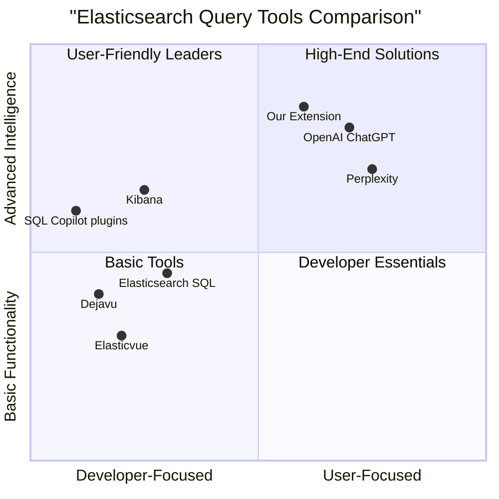
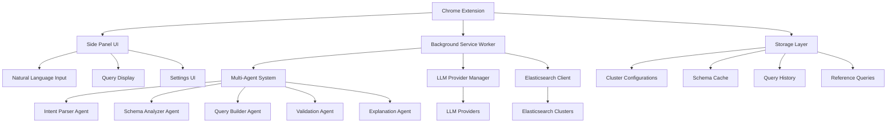

# PRODUCT REQUIREMENTS DOCUMENT
# Elasticsearch Query Helper AI Chrome Extension

## 1. Introduction

### Product Overview
Elasticsearch Query Helper is a Chrome extension that transforms natural language queries into precise Elasticsearch DSL queries using a multi-agent AI architecture. Built on BrowserBee's proven Chrome extension framework, it simplifies the complex task of writing Elasticsearch queries while supporting configurable clusters, dynamic schema discovery, and personalized reference query learning.

### Product Vision
To eliminate the Elasticsearch query syntax learning curve by providing an intuitive natural language interface that empowers users of all technical levels to harness the full power of Elasticsearch without memorizing complex DSL syntax.

### Key Value Propositions
- **Zero Learning Curve**: Convert natural language to complex Elasticsearch queries instantly
- **Universal Compatibility**: Works with any Elasticsearch cluster (local, cloud, enterprise)
- **Intelligent Adaptation**: Learns from user-provided query examples and schema context
- **Enterprise Ready**: Built on BrowserBee's proven Chrome extension architecture with security focus

## 2. Market Analysis

### Market Need
Elasticsearch is a powerful search and analytics engine used by thousands of organizations worldwide, but its complex query syntax creates significant barriers for new users and slows development even for experienced users. Current solutions either lack sophistication or exist as standalone tools requiring context switching away from the browser environment where most searching occurs.

### Target Market
The primary target market consists of:
- **Developers**: Software engineers working with Elasticsearch
- **Data Analysts**: Business analysts who need to query data without deep technical expertise
- **DevOps Engineers**: Managing multiple Elasticsearch clusters across environments
- **BI Teams**: Requiring data exploration capabilities for reporting

### Competitive Analysis

| Competitor | Type | Pros | Cons |
|------------|------|------|------|
| **Kibana** | Built-in Elasticsearch UI | - Native integration<br>- Full visualization suite<br>- Dashboard creation | - Limited natural language support<br>- Not accessible outside Kibana<br>- Steep learning curve |
| **Elasticsearch SQL** | Official plugin | - Familiar SQL syntax<br>- Good for database users<br>- Enterprise support | - Not truly natural language<br>- Limited to SQL expressibility<br>- Separate product to license |
| **OpenAI ChatGPT** | General AI | - Understands natural language<br>- Handles complex intent<br>- Continuous improvement | - No direct ES integration<br>- No schema awareness<br>- No query validation |
| **Perplexity** | AI search platform | - Natural language interface<br>- Research capabilities<br>- User-friendly | - Not specific to Elasticsearch<br>- No schema awareness<br>- No execution capability |
| **Elasticvue** | Chrome extension | - Direct ES integration<br>- Good developer UX<br>- Free | - No natural language<br>- Basic UI<br>- Minimal intelligence |
| **Dejavu** | Web UI for Elasticsearch | - Strong data browsing<br>- Good developer tools<br>- Open source | - Query-building focused<br>- Requires setup<br>- No natural language |
| **SQL Copilot plugins** | IDE plugins | - Context awareness<br>- IDE integration<br>- Code completion | - SQL only, not ES DSL<br>- Limited to coding context<br>- Separate from browser |

### Competitive Quadrant Chart



## 3. User Personas

### Primary: Elasticsearch Developer Dana
- **Role**: Software Engineer at mid-size tech company
- **Experience**: 3+ years of development, 1 year with Elasticsearch
- **Goals**: Decrease query development time, increase productivity
- **Pain Points**: 
  - Struggles with complex query syntax for aggregations
  - Spends excessive time debugging query issues
  - Needs to reference documentation frequently
- **Success Scenario**: Reduces query development time by 50%

### Secondary: Data Analyst Alex
- **Role**: Business Intelligence Analyst at e-commerce company
- **Experience**: Expert in SQL, beginner with Elasticsearch
- **Goals**: Generate business insights without learning complex ES DSL
- **Pain Points**:
  - Struggles with the transition from SQL to ES DSL
  - Relies on developers for complex queries
  - Limited by knowledge gaps in query capabilities
- **Success Scenario**: Creates advanced aggregation queries independently

### Tertiary: DevOps Engineer Morgan
- **Role**: Platform Engineer managing multiple environments
- **Experience**: Expert in infrastructure, intermediate with Elasticsearch
- **Goals**: Standardize query patterns across environments
- **Pain Points**:
  - Manages clusters with different schema structures
  - Needs to ensure query performance across environments
  - Struggles with query optimization
- **Success Scenario**: Creates a shared query library for the team

### Quaternary: Product Manager Jamie
- **Role**: Product leader with technical background
- **Experience**: No direct Elasticsearch experience
- **Goals**: Self-service data access without technical dependencies
- **Pain Points**:
  - Cannot independently explore product analytics data
  - Relies on data team for basic insights
  - Communication barriers slow decision-making
- **Success Scenario**: Performs basic data exploration independently

## 4. Product Roadmap

### Generation 1: Core Query Assistant (Months 1-3)
**Target Users**: Individual developers and data analysts  
**Core Value**: Reliable natural language to Elasticsearch DSL conversion

#### P0: Must-Have Features
- Natural language query input with instant DSL generation
- Support for basic query types (term, match, bool, range)
- Single Elasticsearch cluster connection configuration
- Query validation and syntax checking
- Copy-to-clipboard functionality with formatted output

#### P1: Should-Have Features
- Support for complex queries (aggregations, nested objects)
- Query explanation in plain language
- Basic schema discovery and mapping
- Query history with simple search
- Minimal styling and formatting options

#### P2: Nice-to-Have Features
- Pre-configured templates for common queries
- Bookmark favorite queries
- Basic error suggestions
- Light/dark mode toggle

### Generation 2: Configurable Ecosystem (Months 4-6)
**Target Users**: Data teams and small organizations  
**Core Value**: Flexible multi-cluster support with custom training

#### P0: Must-Have Features
- Multiple Elasticsearch cluster management
- Dynamic schema discovery and analysis
- Custom query reference file upload (JSON, CSV)
- Project-based configuration management
- Advanced validation with performance insights

#### P1: Should-Have Features
- Schema-aware field suggestions
- Query history and pattern learning
- Customizable output formats (JSON, curl, Kibana)
- Query performance metrics and optimization tips

#### P2: Nice-to-Have Features
- AI-powered query optimization suggestions
- Query sharing via URL or export
- Visual query builder integration

### Generation 3: Collaborative Intelligence (Months 7-9)
**Target Users**: Enterprise teams and organizations  
**Core Value**: Team collaboration and shared knowledge base

#### P0: Must-Have Features
- Team workspaces with shared query libraries
- Real-time collaborative query editing
- Version control for query development
- Enterprise SSO integration

#### P1: Should-Have Features
- Advanced debugging and explanations
- Query execution cost analysis
- Performance analytics and optimization recommendations
- Role-based access controls

#### P2: Nice-to-Have Features
- Integration with CI/CD pipelines
- Query impact analysis
- Custom extension via plugins

## 5. Functional Requirements

### 5.1 Core Query Engine (Generation 1)

#### Natural Language Processing
- **Must** accept free-form text in multiple languages (English primary)
- **Must** process queries using multi-agent AI system
- **Must** generate valid Elasticsearch 7.x and 8.x DSL
- **Must** return results within 30 seconds for typical queries
- **Must** achieve >85% syntactically correct queries
- **Should** provide explanations for generated queries
- **Should** handle common query variations and synonyms
- **May** suggest alternative queries for ambiguous input

#### Query Types Support
- **Must** support basic query types:
  - Match queries (full text search)
  - Term queries (exact value matches)
  - Range queries (numeric and date ranges)
  - Boolean compound queries
- **Should** support intermediate query types:
  - Multi-match queries
  - Fuzzy queries
  - Wildcard queries
  - Prefix and suffix queries
- **Should** support aggregation queries:
  - Metric aggregations (min, max, avg, sum)
  - Bucket aggregations (terms, date histogram)
- **May** support advanced queries:
  - Nested and parent-child queries
  - Geo-spatial queries
  - Function score queries

### 5.2 Multi-Agent Architecture

#### Agent 1: Intent Parser
- **Must** extract entities, query type, and parameters from natural language
- **Must** identify the core search intent (find, count, aggregate)
- **Must** recognize field names and value constraints
- **Should** handle ambiguous field references through context
- **Should** provide confidence scoring for parsed intents

#### Agent 2: Schema Analyzer
- **Must** understand provided Elasticsearch mappings
- **Must** identify field types and relationships
- **Should** discover field analysis settings (analyzers, tokenizers)
- **Should** detect nested objects and parent-child relationships
- **May** suggest schema optimizations

#### Agent 3: Query Builder
- **Must** construct valid Elasticsearch DSL JSON
- **Must** validate field names against schema
- **Must** match field types with appropriate query clauses
- **Should** optimize query structure for performance
- **Should** generate multiple query variations when appropriate

#### Agent 4: Validation Agent
- **Must** verify query syntax and structure
- **Must** check for common query pitfalls
- **Should** validate against Elasticsearch version constraints
- **Should** provide error messages in plain language
- **May** estimate query performance implications

#### Agent 5: Explanation Agent
- **Must** explain query components in plain language
- **Should** highlight key parts of the generated query
- **Should** explain why specific approaches were chosen
- **May** suggest query improvements

### 5.3 Configuration Management (Generation 2)

#### Elasticsearch Cluster Management
- **Must** support HTTP/HTTPS connections
- **Must** support authentication methods:
  - Basic auth (username/password)
  - API Key authentication
  - Bearer token authentication
- **Must** verify connectivity before saving configurations
- **Should** store credentials securely using Chrome's storage API
- **Should** support multiple cluster configurations
- **May** detect Elasticsearch version automatically

#### Schema Discovery
- **Must** retrieve index mappings automatically
- **Must** parse field types and properties
- **Should** detect analyzers and tokenizers
- **Should** identify field relationships
- **May** cache schema for offline use

### 5.4 Reference Query System (Generation 2)

#### Custom Training Data
- **Must** allow upload of example queries in JSON format
- **Must** validate uploaded queries before processing
- **Should** extract patterns and styles from examples
- **Should** learn from user query history
- **May** suggest improvements to existing queries

## 6. Technical Requirements

### 6.1 Browser Extension Infrastructure
- **Must** implement Chrome Extension Manifest V3
- **Must** use service worker for background processing
- **Must** implement side panel UI for query interaction
- **Should** minimize required permissions
- **Should** handle offline functionality gracefully

### 6.2 Performance Requirements
- **Must** generate queries within 30 seconds
- **Must** keep memory usage below 200MB
- **Should** implement caching for repeated queries
- **Should** optimize token usage for LLM calls
- **May** implement progressive query generation for better UX

### 6.3 Security Requirements
- **Must** store API keys and credentials securely
- **Must** implement data minimization principles
- **Must** provide clear permissions disclosure
- **Should** encrypt sensitive data in local storage
- **Should** implement timeout for stored credentials
- **May** support enterprise SSO authentication methods

## 7. User Experience

### 7.1 Interface Design
- **Must** provide a clean, intuitive Chrome side panel interface
- **Must** include a prominent query input area
- **Must** display generated queries with syntax highlighting
- **Should** offer light and dark mode themes
- **Should** provide loading indicators for query generation
- **May** offer resizable panel views

### 7.2 Core User Flows

#### Flow 1: Initial Setup
1. User installs the Chrome extension
2. User opens the side panel
3. User is prompted to configure Elasticsearch connection
4. User enters cluster URL and authentication details
5. System tests connection and retrieves schema
6. User receives confirmation of successful setup

#### Flow 2: Basic Query Generation
1. User opens side panel on any page
2. User types natural language query: "Find documents where status is active and created in the last 7 days"
3. System processes query through multi-agent pipeline
4. System displays generated Elasticsearch DSL with syntax highlighting
5. User reviews query and explanation
6. User copies query with one click

#### Flow 3: Learning from Examples (Gen 2)
1. User navigates to settings
2. User selects "Upload Reference Queries"
3. User uploads JSON file with example queries
4. System validates and processes queries
5. System confirms successful learning
6. User returns to query input with enhanced query generation

#### Flow 4: Multi-Cluster Management (Gen 2)
1. User navigates to cluster settings
2. User adds new cluster configuration
3. System tests connection and retrieves schema
4. User sets a display name and optional color coding
5. User can now switch between clusters from dropdown

## 8. Success Metrics

### 8.1 Technical KPIs
- **Query Accuracy**: 85% valid queries (Gen 1), 90% (Gen 2), 95% (Gen 3)
- **Schema Compatibility**: 95% successful schema discovery
- **Response Time**: <30s (Gen 1), <20s (Gen 2), <10s (Gen 3)
- **System Reliability**: 99% uptime, <1% error rate

### 8.2 User Experience KPIs
- **Task Completion Rate**: 80% successful query generation on first attempt
- **User Satisfaction**: >4.0/5.0 rating in Chrome Web Store
- **Adoption Rate**: 70% weekly active users among installs
- **Learning Curve**: <10 minutes to first successful query

### 8.3 Business KPIs
- **User Growth**: 1,000 users (Gen 1), 5,000 users (Gen 2), 15,000 users (Gen 3)
- **Engagement**: Average 5+ queries per session
- **Retention**: 60% monthly active users
- **Enterprise Adoption**: 10+ enterprise customers by Generation 3

## 9. Open Questions and Considerations

### 9.1 Technical Considerations
- Which LLM providers should be supported in the initial release?
- How should we handle extremely complex queries that exceed token limits?
- What strategy should we use for offline functionality?
- How can we optimize schema parsing for large, complex Elasticsearch clusters?

### 9.2 UX Considerations
- What level of query customization should we allow after generation?
- How should we handle multi-language support for natural language input?
- What visualization options should we provide for complex aggregation queries?
- How can we make the learning process transparent to users?

### 9.3 Business Considerations
- What pricing model makes sense for different user segments?
- How should we handle enterprise deployment and licensing?
- What partnerships with Elasticsearch vendors should we pursue?
- How can we build a community around query sharing and best practices?

## 10. Appendix

### 10.1 Sample Multi-Agent Processing Example

**User input**: "Show me active users who logged in this month and have made at least 3 purchases, grouped by country"

**Agent 1 (Intent Parser)** extracts:
- Target: users
- Filters: status=active, login_date=this month, purchases_count>=3
- Grouping: by country

**Agent 2 (Schema Analyzer)** identifies:
- users index with fields:
  - status (keyword)
  - last_login (date)
  - purchases (integer)
  - country (keyword)

**Agent 3 (Query Builder)** constructs:
```json
{
  "size": 0,
  "query": {
    "bool": {
      "must": [
        { "term": { "status": "active" } },
        { "range": { "last_login": { "gte": "now/M" } } },
        { "range": { "purchases": { "gte": 3 } } }
      ]
    }
  },
  "aggs": {
    "countries": {
      "terms": { "field": "country", "size": 100 }
    }
  }
}
```

**Agent 4 (Validation Agent)** verifies:
- All fields exist in the schema
- Query syntax is valid
- No performance issues detected

**Agent 5 (Explanation Agent)** explains:
"This query filters users with 'active' status who logged in since the beginning of the current month and have made at least 3 purchases. The results are aggregated by country, showing a count of users per country."


### 10.2 Example Queries and Responses

#### Example 1: Basic Search

**Natural Language**: "Find all documents where the status is published and category is technology"

**Generated Query**:
```json
{
  "query": {
    "bool": {
      "must": [
        { "term": { "status": "published" } },
        { "term": { "category": "technology" } }
      ]
    }
  }
}
```

#### Example 2: Date Ranges and Sorting

**Natural Language**: "Get articles from the last 30 days with more than 100 views, sorted by popularity"

**Generated Query**:
```json
{
  "query": {
    "bool": {
      "must": [
        { "range": { "date": { "gte": "now-30d/d" } } },
        { "range": { "views": { "gt": 100 } } }
      ]
    }
  },
  "sort": [
    { "popularity": { "order": "desc" } }
  ]
}
```

#### Example 3: Complex Aggregation

**Natural Language**: "Show a breakdown of sales by product category and country for the past quarter, focusing on transactions over $1000"

**Generated Query**:
```json
{
  "query": {
    "bool": {
      "must": [
        { "range": { "date": { "gte": "now-3M/M" } } },
        { "range": { "amount": { "gt": 1000 } } }
      ]
    }
  },
  "aggs": {
    "categories": {
      "terms": { "field": "product_category", "size": 20 },
      "aggs": {
        "countries": {
          "terms": { "field": "country", "size": 20 },
          "aggs": {
            "total_sales": { "sum": { "field": "amount" } },
            "avg_sale": { "avg": { "field": "amount" } }
          }
        }
      }
    }
  },
  "size": 0
}
```

### 10.3 Technical Architecture Overview



### 10.4 Security Considerations

#### Data Storage
- API keys and credentials will be stored in Chrome's secure storage API using encryption
- No query data will be stored on external servers
- Schema data will be encrypted when cached locally

#### Privacy Measures
- Minimal permissions model: only requires access to side panel and storage
- No tracking or telemetry data collection without explicit consent
- Clear separation between user data and extension functionality

#### Authentication
- Support for multiple authentication methods to match enterprise security requirements
- Timeouts for stored credentials
- Optional integration with corporate SSO systems (Generation 3)


### 10.5 UI Mockups

#### Main Interface (Side Panel)

```
┌─────────────────────────────────────┐
│ Elasticsearch Query Helper         ✕ │
├─────────────────────────────────────┤
│ ┌─────────────────────┐  ┌───────┐ │
│ │ dev-cluster         │  │ ⚙️     │ │
│ └─────────────────────┘  └───────┘ │
│                                     │
│ What would you like to search for? │
│ ┌─────────────────────────────────┐ │
│ │ Find users who registered in    │ │
│ │ the last month with email       │ │
│ │ verification complete           │ │
│ │                                 │ │
│ └─────────────────────────────────┘ │
│                                     │
│ ┌─────────────────────────────────┐ │
│ │ Generated Query                 │ │
│ ├─────────────────────────────────┤ │
│ │ {                               │ │
│ │   "query": {                    │ │
│ │     "bool": {                   │ │
│ │       "must": [                 │ │
│ │         {                       │ │
│ │           "range": {            │ │
│ │             "registration_date":│ │
│ │             { "gte": "now-1M" } │ │
│ │           }                     │ │
│ │         },                      │ │
│ │         {                       │ │
│ │           "term": {             │ │
│ │             "email_verified":   │ │
│ │             true                │ │
│ │           }                     │ │
│ │         }                       │ │
│ │       ]                         │ │
│ │     }                           │ │
│ │   }                             │ │
│ │ }                               │ │
│ └─────────────────────────────────┘ │
│                                     │
│ ┌────────┐ ┌────────┐ ┌──────────┐ │
│ │Copy JSON│ │Copy cURL│ │Explanation│ │
│ └────────┘ └────────┘ └──────────┘ │
│                                     │
│ Explanation:                        │
│ This query finds users who          │
│ registered in the last 30 days      │
│ AND have verified their email       │
│ address.                            │
└─────────────────────────────────────┘
```

#### Settings Panel 

```
┌─────────────────────────────────────┐
│ Settings                          ✕ │
├─────────────────────────────────────┤
│ Elasticsearch Connections           │
│ ┌─────────────────────────────────┐ │
│ │ ● dev-cluster                   │ │
│ │   https://localhost:9200        │ │
│ │                               🖊️ │ │
│ ├─────────────────────────────────┤ │
│ │ ○ prod-cluster                  │ │
│ │   https://es-prod.example.com   │ │
│ │                               🖊️ │ │
│ └─────────────────────────────────┘ │
│                                     │
│ ┌─────────────────────────────────┐ │
│ │ + Add New Connection            │ │
│ └─────────────────────────────────┘ │
│                                     │
│ Reference Queries                   │
│ ┌─────────────────────────────────┐ │
│ │ Upload JSON File                │ │
│ └─────────────────────────────────┘ │
│                                     │
│ LLM Provider                        │
│ ┌─────────────────────┐            │
│ │ OpenAI              │            │
│ └─────────────────────┘            │
│                                     │
│ API Key                             │
│ ┌─────────────────────────────────┐ │
│ │ ●●●●●●●●●●●●●●●●●●●●             │ │
│ └─────────────────────────────────┘ │
│                                     │
│ Theme                               │
│ ┌─────────┐ ┌─────────┐            │
│ │ Light   │ │ Dark    │            │
│ └─────────┘ └─────────┘            │
│                                     │
│ ┌─────────┐ ┌─────────────────────┐ │
│ │ Cancel  │ │ Save Settings       │ │
│ └─────────┘ └─────────────────────┘ │
└─────────────────────────────────────┘
```

## 11. Conclusion

The Elasticsearch Query Helper Chrome Extension represents a significant advancement in making Elasticsearch's powerful query capabilities accessible to users of all technical levels. By leveraging BrowserBee's proven multi-agent AI architecture, this extension will transform the Elasticsearch query experience from a complex syntax challenge to an intuitive natural language conversation.

With a clear focus on improving developer productivity and reducing technical barriers, the extension has the potential to dramatically increase the accessibility and utility of Elasticsearch across organizations. The phased generation approach ensures we can deliver immediate value while building toward a comprehensive collaborative solution for enterprise use cases.

Implementation should begin with the core natural language processing capabilities while leveraging BrowserBee's existing Chrome extension architecture to accelerate development.
