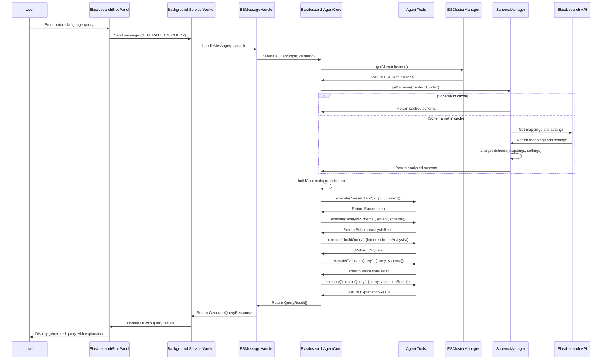
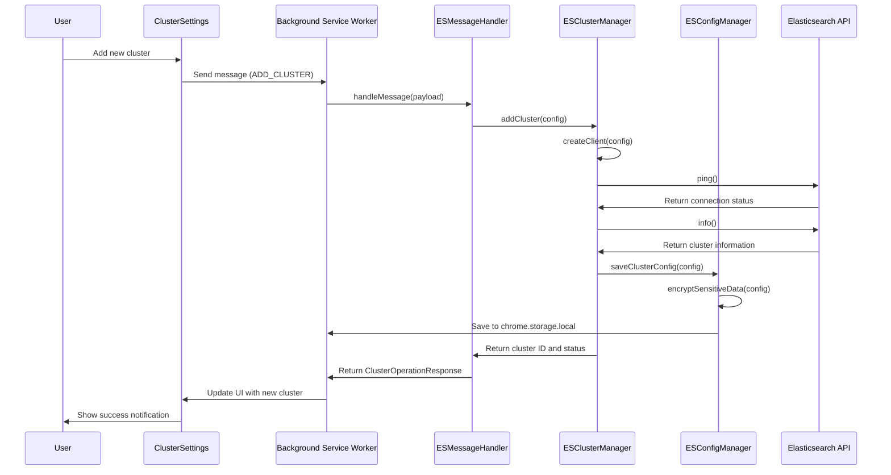
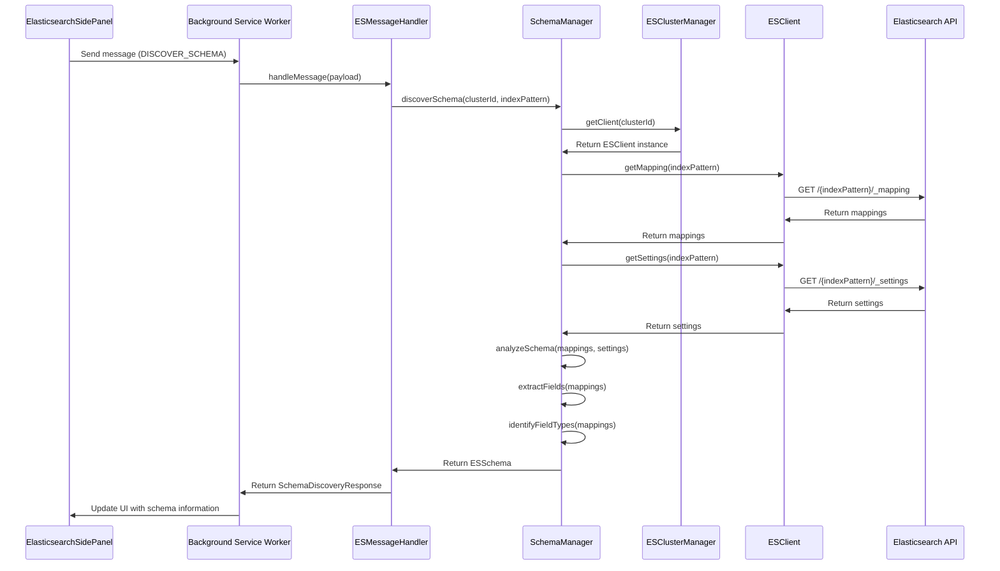

# System Design: Elasticsearch Query Helper Chrome Extension

## Implementation approach

The Elasticsearch Query Helper Chrome Extension will be built by extending BrowserBee's proven multi-agent architecture. Based on the provided requirements and integration analysis, we'll use a direct extension approach to leverage existing BrowserBee infrastructure while adding Elasticsearch-specific functionality.

Key technical decisions:

1. **Extension Architecture**: Chrome Extension with Manifest V3 utilizing service worker and side panel UI
2. **Agent System**: Multi-agent architecture with 5 specialized agents for query processing
3. **LLM Integration**: Reuse BrowserBee's LLM provider system for flexibility across providers
4. **Framework Selection**:
   - Frontend: React.js with Tailwind CSS (consistent with BrowserBee UI)
   - State Management: React Context API for global state
   - Elasticsearch Client: Lightweight elasticsearch-browser client for cluster communication
5. **Storage**: Chrome Storage API for configurations with encryption for sensitive data

The system will be implemented in TypeScript to ensure type safety and better integration with BrowserBee's existing codebase.

## Data structures and interfaces

The architecture extends BrowserBee's core components with Elasticsearch-specific implementations. Below are the key data structures and interfaces:

```mermaid
classDiagram
    %% Core Agent System
    class AgentCore {
        <<BrowserBee>>
        +executionEngine: ExecutionEngine
        +toolManager: ToolManager
        +errorHandler: ErrorHandler
        +execute(task: Task) Promise<Result>
    }
    
    class ElasticsearchAgentCore {
        +esClusterManager: ESClusterManager
        +schemaManager: SchemaManager
        +queryLibraryManager: QueryLibraryManager
        +generateQuery(userInput: string, targetCluster: string) Promise<QueryResult[]>
        +validateQuery(query: ESQuery, schema: ESSchema) Promise<ValidationResult>
        +explainQuery(query: ESQuery) Promise<string>
        +buildContext(input: string, clusterId: string) Promise<ESQueryContext>
    }
    
    class ExecutionEngine {
        <<BrowserBee>>
        +llmProvider: LLMProvider
        +execute(toolName: string, params: any) Promise<any>
    }
    
    %% Elasticsearch Tools
    class Tool {
        <<interface>>
        +name: string
        +description: string
        +execute(params: any) Promise<any>
    }
    
    class IntentParsingTool {
        +name: "parseIntent"
        +execute(params: IntentParsingParams) Promise<ParsedIntent>
        -buildSystemPrompt(schema: ESSchema) string
        -buildUserPrompt(input: string, references: Query[]) string
        -parseIntentResponse(response: string) ParsedIntent
        -validateIntent(intent: ParsedIntent, schema: ESSchema) ParsedIntent
    }
    
    class SchemaAnalyzerTool {
        +name: "analyzeSchema"
        +execute(params: SchemaAnalysisParams) Promise<SchemaAnalysisResult>
        -analyzeFieldTypes(schema: ESSchema) FieldTypeMap
        -detectRelationships(schema: ESSchema) FieldRelationshipMap
        -suggestOptimizations(schema: ESSchema) Optimization[]
    }
    
    class QueryBuilderTool {
        +name: "buildQuery"
        +execute(params: QueryBuildingParams) Promise<ESQuery>
        -buildQueryClause(intent: ParsedIntent) ESQueryClause
        -buildSortClause(intent: ParsedIntent) ESSortClause[]
        -buildAggregationClause(intent: ParsedIntent) ESAggsClause
        -optimizeQuery(query: ESQuery, schema: ESSchema) ESQuery
    }
    
    class ValidationTool {
        +name: "validateQuery"
        +execute(params: ValidationParams) Promise<ValidationResult>
        -validateSyntax(query: ESQuery) SyntaxResult
        -validateFields(query: ESQuery, schema: ESSchema) FieldValidationResult
        -checkPerformance(query: ESQuery, schema: ESSchema) PerformanceInsights
    }
    
    class ExplanationTool {
        +name: "explainQuery"
        +execute(params: ExplanationParams) Promise<ExplanationResult>
        -generatePlainLanguage(query: ESQuery) string
        -highlightKeyParts(query: ESQuery) HighlightedQuery
        -suggestImprovements(query: ESQuery, validation: ValidationResult) Suggestion[]
    }
    
    %% Elasticsearch Services
    class ESClusterManager {
        +clusters: Map<string, ESClusterConfig>
        +activeCluster: string
        +healthChecks: Map<string, ClusterHealth>
        +addCluster(config: ESClusterConfig) Promise<string>
        +removeCluster(clusterId: string) Promise<void>
        +getClient(clusterId: string) Promise<ESClient>
        +testConnection(config: ESClusterConfig) Promise<ClusterHealth>
        +setActiveCluster(clusterId: string) void
        -createClient(config: ESClusterConfig) ESClient
        -parseConnectionString(url: string) ESConnectionDetails
    }
    
    class SchemaManager {
        +schemaCache: Map<string, ESSchema>
        +discoverSchema(clusterId: string, indexPattern: string) Promise<ESSchema>
        +getSchema(clusterId: string, indexPattern: string) Promise<ESSchema>
        +updateSchema(clusterId: string, indexPattern: string) Promise<ESSchema>
        +clearCache(clusterId?: string) Promise<void>
        -analyzeSchema(mappings: any, settings: any) ESSchema
        -extractFields(mappings: any) ESFieldMap
        -identifyFieldTypes(mappings: any) ESFieldTypeInfo[]
    }
    
    class QueryLibraryManager {
        +referenceQueries: Map<string, ReferenceQuerySet>
        +addReferenceQueries(clusterId: string, queries: ESQuery[]) Promise<void>
        +getReferenceQueries(clusterId: string, context?: string) Promise<ESQuery[]>
        +processUploadedFile(file: File) Promise<ESQuery[]>
        +saveQueryToLibrary(query: ESQuery, name: string, tags: string[]) Promise<void>
        -validateQueries(queries: ESQuery[]) ValidationResult[]
        -extractPatterns(queries: ESQuery[]) QueryPattern[]
    }
    
    %% Elasticsearch Client
    class ESClient {
        +host: string
        +port: number
        +protocol: string
        +auth: ESAuth
        +connect() Promise<ConnectionStatus>
        +getIndices() Promise<string[]>
        +getMapping(index: string) Promise<ESMapping>
        +getSettings(index: string) Promise<ESSettings>
        +search(params: SearchParams) Promise<SearchResult>
        +ping() Promise<boolean>
        +info() Promise<ClusterInfo>
    }
    
    %% Configuration & Storage
    class ESConfigManager {
        +loadClusterConfigs() Promise<ESClusterConfig[]>
        +saveClusterConfig(config: ESClusterConfig) Promise<void>
        +deleteClusterConfig(clusterId: string) Promise<void>
        +loadQueryHistory(clusterId: string) Promise<QueryHistoryItem[]>
        +saveQueryHistory(clusterId: string, query: QueryHistoryItem) Promise<void>
        +saveUserPreferences(prefs: UserPreferences) Promise<void>
        +loadUserPreferences() Promise<UserPreferences>
        -encryptSensitiveData(data: any) Promise<string>
        -decryptSensitiveData(encryptedData: string) Promise<any>
    }
    
    %% UI Components
    class ElasticsearchSidePanel {
        +messages: Message[]
        +esState: ESState
        +activeCluster: ESClusterConfig
        +handleQuerySubmit(query: string) Promise<void>
        +handleClusterChange(clusterId: string) void
        +handleSettingsOpen() void
        +render() ReactElement
    }
    
    class QueryResultCard {
        +result: QueryResult
        +expanded: boolean
        +handleCopy(format: string) Promise<void>
        +handleFeedback(feedback: QueryFeedback) void
        +handleExpand() void
        +render() ReactElement
    }
    
    class ClusterSettings {
        +clusters: ESClusterConfig[]
        +activeCluster: string
        +handleAddCluster(config: ESClusterConfig) Promise<void>
        +handleEditCluster(clusterId: string, config: ESClusterConfig) Promise<void>
        +handleRemoveCluster(clusterId: string) Promise<void>
        +handleTestConnection(config: ESClusterConfig) Promise<ConnectionStatus>
        +render() ReactElement
    }
    
    %% Main Message Handling
    class MessageHandler {
        <<BrowserBee>>
        +handlers: Map<string, MessageHandlerFn>
        +registerHandler(type: string, handler: MessageHandlerFn) void
        +handleMessage(message: Message) Promise<any>
    }
    
    class ESMessageHandler {
        +agentCore: ElasticsearchAgentCore
        +clusterManager: ESClusterManager
        +configManager: ESConfigManager
        +handleGenerateQuery(payload: GenerateQueryPayload) Promise<GenerateQueryResponse>
        +handleClusterOperation(payload: ClusterOperationPayload) Promise<ClusterOperationResponse>
        +handleSchemaDiscovery(payload: SchemaDiscoveryPayload) Promise<SchemaDiscoveryResponse>
        +handleQueryHistory(payload: QueryHistoryPayload) Promise<QueryHistoryResponse>
        +initialize() void
    }
    
    %% Relationships
    AgentCore <|-- ElasticsearchAgentCore : extends
    ElasticsearchAgentCore o-- ESClusterManager
    ElasticsearchAgentCore o-- SchemaManager
    ElasticsearchAgentCore o-- QueryLibraryManager
    AgentCore *-- ExecutionEngine
    
    Tool <|.. IntentParsingTool : implements
    Tool <|.. SchemaAnalyzerTool : implements
    Tool <|.. QueryBuilderTool : implements
    Tool <|.. ValidationTool : implements
    Tool <|.. ExplanationTool : implements
    
    ESClusterManager o-- ESClient
    ESClusterManager --> ESConfigManager : uses
    SchemaManager --> ESClusterManager : uses
    QueryLibraryManager --> ESConfigManager : uses
    
    MessageHandler <|-- ESMessageHandler : extends
    ESMessageHandler o-- ElasticsearchAgentCore
    ESMessageHandler o-- ESClusterManager
    ESMessageHandler o-- ESConfigManager
    
    ElasticsearchSidePanel o-- QueryResultCard
    ElasticsearchSidePanel o-- ClusterSettings
```

## Program call flow

The following sequence diagrams illustrate the key interactions within the system:

### Query Generation Flow

### Cluster Configuration Flow

### Schema Discovery Flow

## Anything UNCLEAR

Several aspects of the implementation require further clarification:

1. **LLM Provider Interface**: The exact interface between BrowserBee's LLM provider system and our Elasticsearch-specific agents needs to be clearly defined. We should determine how to pass Elasticsearch context efficiently to the LLM within token limits.

2. **Schema Size Management**: Elasticsearch schemas can be very large and complex. We'll need a strategy for summarizing/truncating schemas to fit within LLM token limits while maintaining essential information for query generation.

3. **BrowserBee Extension Points**: The exact extension points within BrowserBee need to be identified to ensure smooth integration. This includes understanding how to extend the AgentCore class and interact with the service worker.

4. **Error Handling Strategy**: A comprehensive error handling strategy needs to be developed across the multi-agent system, especially for handling cases where LLM providers may return invalid or unexpected results.

5. **Query Validation**: The exact approach for validating generated queries without executing them against Elasticsearch needs to be determined. This might involve developing a lightweight parser or leveraging existing libraries.

6. **Security Review**: A thorough security review is needed to ensure proper handling of Elasticsearch credentials and secure communication with clusters.

Despite these open questions, the overall architecture provides a solid foundation for implementing the Elasticsearch Query Helper Chrome Extension based on BrowserBee's multi-agent architecture.